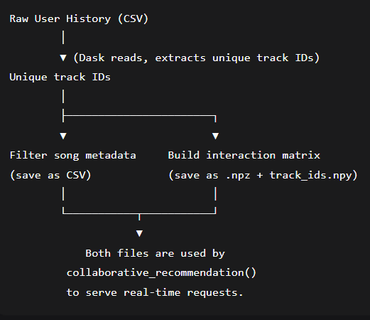
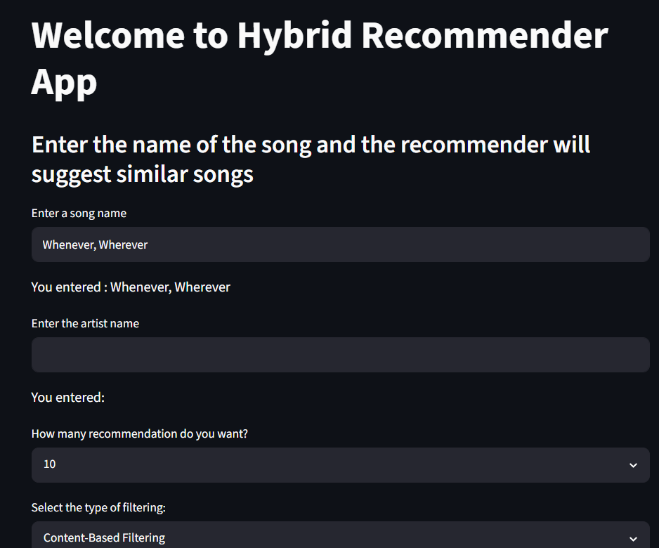
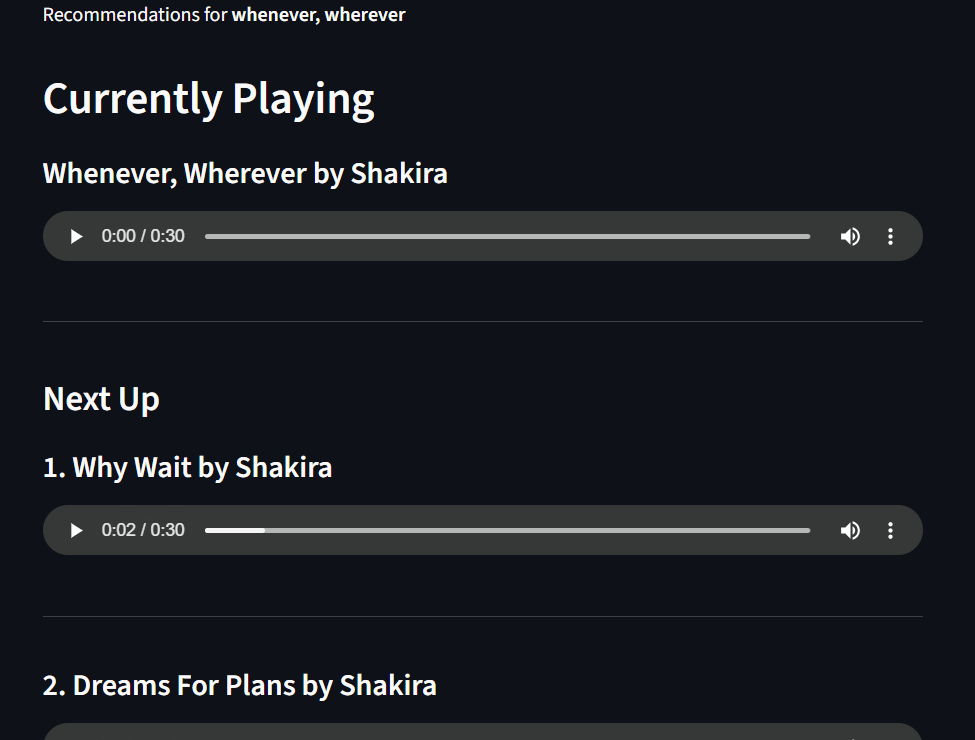

# 🎵 Music Recommendation System

A hybrid music recommendation engine that combines **collaborative filtering** (based on user listening history) and **content‑based filtering** (based on audio features and metadata). The system is deployed as an interactive **Streamlit** web application, and the entire data pipeline is version‑controlled with **DVC** for full reproducibility.

---

## 📖 Table of Contents

- [Overview](#-overview)
- [Key Features](#-key-features)
- [How It Works](#-how-it-works)
  - [Content‑Based Filtering](#contentbased-filtering)
  - [Collaborative Filtering](#collaborative-filtering)
- [Project Structure](#-project-structure)
- [Dataset](#-dataset)
- [Installation & Setup](#-installation--setup)
- [DVC Pipeline](#-dvc-pipeline)
- [Running the Streamlit App](#-running-the-streamlit-app)
- [Code Deep Dive](#-code-deep-dive)
  - [Data Cleaning (`data_cleaning.py`)](#data-cleaning-data_cleaningpy)
  - [Content‑Based Module (`content_based_filtering.py`)](#contentbased-module-content_based_filteringpy)
  - [Collaborative Module (`collaborative_filtering.py`)](#collaborative-module-collaborative_filteringpy)
- [Future Improvements](#-future-improvements)
- [Contributing](#-contributing)
- [License](#-license)

---
## data flow diagram

## 🚀 Overview

This project solves the music recommendation problem using two distinct paradigms:

| Approach | Input Data | Core Technique |
|----------|------------|----------------|
| **Content‑Based** | Song metadata (artist, key, tempo, danceability, tags, etc.) | Feature vectorisation + cosine similarity |
| **Collaborative** | User–song interactions (playcounts) | Sparse matrix factorisation (implicit) + cosine similarity |

Users interact with a **Streamlit** web interface: they enter a song name, optionally specify the artist, choose the number of recommendations, and pick which filtering strategy to use. The app then displays the top‑K most similar songs along with Spotify preview links.

---

## ✨ Key Features

- **Dual recommendation engines** – choose between collaborative and content‑based on the fly.
- **Scalable data handling** – uses `Dask` to read large history CSVs and `scipy.sparse` for memory‑efficient matrices.
- **Pre‑computed offline models** – both the interaction matrix and the content feature matrix are built during training and loaded instantly at runtime.
- **Reproducible pipelines** – the entire workflow (cleaning → transformation → matrix building) is defined in `dvc.yaml` and can be re‑run with a single command.
- **Clean Streamlit UI** – intuitive interface with real‑time recommendations and preview links.

---

## 🔍 How It Works

### Content‑Based Filtering

This method recommends songs that are *similar in terms of their intrinsic properties* – such as audio features, artist, genre tags, and key.

1. **Feature Engineering** – a `ColumnTransformer` applies different transformations to each column group:
   - `CountEncoder` (normalised) → `year`
   - `OneHotEncoder` → `artist`, `time_signature`, `key`
   - `TfidfVectorizer` (max 85 features) → `tags` (comma‑separated genres/moods)
   - `StandardScaler` → `duration_ms`, `loudness`, `tempo`
   - `MinMaxScaler` → `danceability`, `energy`, `speechiness`, `acousticness`, `instrumentalness`, `liveness`, `valence`

2. **Similarity Calculation** – the transformed feature matrix (shape: `n_songs × n_features`) is stored as a sparse `.npz` file. When a user requests a recommendation, we extract the feature vector for the input song and compute **cosine similarity** with every other song. The top‑K highest scores are returned.

> **Why cosine?** It measures the angle between two vectors, ignoring their magnitude – perfect for comparing high‑dimensional, sparse feature representations.

---

### Collaborative Filtering

This method leverages the **wisdom of the crowd** – songs that are listened to by the same users tend to be similar, regardless of their audio content.

1. **Interaction Matrix** – a sparse matrix of shape `(n_songs, n_users)` is built from the listening history. Each cell `(i, j)` holds the total `playcount` of song `i` by user `j`. Because most users have not listened to most songs, the matrix is mostly zeros – we store it as a `csr_matrix` for extreme memory efficiency.

2. **Similarity Calculation** – for a given song, we retrieve its row vector (which users listened to it and how much). We then compute the cosine similarity between this row and every other row in the matrix. The songs with the highest similarity scores are returned.

> **Why not use Pearson correlation?** Cosine works better for implicit feedback (playcounts) because it naturally handles the fact that some users listen to everything while others listen to very little – it focuses on the *overlap pattern* rather than absolute numbers.

---

## 🧱 Project Structure
